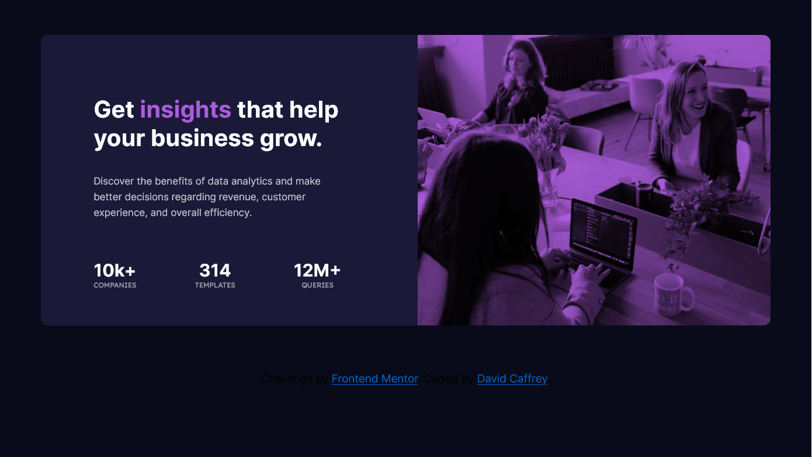

# Frontend Mentor - Stats preview card component solution

This is a solution to the [Stats preview card component challenge on Frontend Mentor](https://www.frontendmentor.io/challenges/stats-preview-card-component-8JqbgoU62). Frontend Mentor challenges help you improve your coding skills by building realistic projects. 

## Table of contents

- [Overview](#overview)
  - [The challenge](#the-challenge)
  - [Screenshot](#screenshot)
  - [Links](#links)
- [My process](#my-process)
  - [Built with](#built-with)
  - [What I learned](#what-i-learned)
  - [Continued development](#continued-development)
  - [Useful resources](#useful-resources)
- [Author](#author)
- [Acknowledgments](#acknowledgments)

## Overview
Create a stats preview card from the design documentation.

### The challenge

Using the two images provided, create two layouts to the filtered/color adjusted images 

### Screenshot

### Links

- Solution URL: [Github ](https://github.com/DavidCaffrey/stats-preview-card)
- Live Site URL: [Netlify Site](https://stats-preview-card-caffrey.netlify.app/)

## My process

### Built with

- Semantic HTML5 markup
- CSS custom properties
- Flexbox
- CSS Grid
- Mobile-first workflow

### What I learned

I learnt to use the picture element to provide multiple images and a fallback image for responsive design. I learnt how to add color effects to 
those images. The ordering of items on the page ie grid items.

### Continued development

I am going to continue working at creating a more streamlined work flow. I need a more systematic approach. Complete more of the Frontend Mentor challenges to build up repetition and a system.

**Note: Delete this note and the content within this section and replace with your own plans for continued development.**

## Author

- Website - [David Caffrey](https://www.caffreymedia.com)
- Frontend Mentor - [David Caffrey](https://www.frontendmentor.io/profile/DavidCaffrey)

